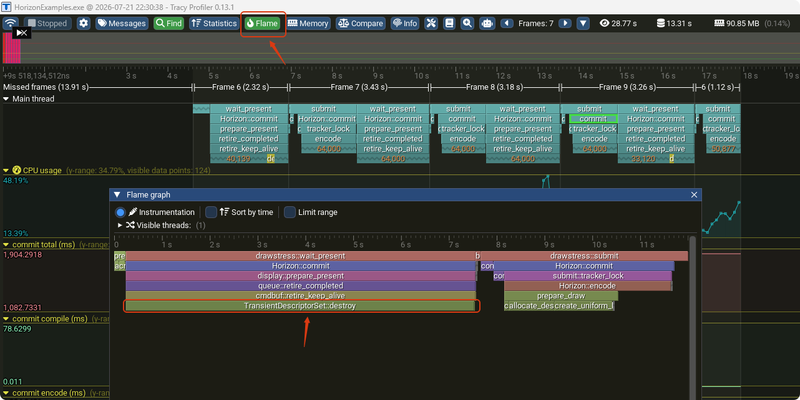

## tracy用法

1、cmake打开

option(HORIZON_ENABLE_TRACY "Enable Tracy profiler instrumentation" OFF)
->
option(HORIZON_ENABLE_TRACY "Enable Tracy profiler instrumentation" ON)

2、编译启动 example

3、打开tracy-profiler.exe 点Connect

4、如果是一帧里调用多的看 火焰图

## Shader 资源使用与设计

> 注：这是当前最终的设计方案，仍在持续调整中。

Horizon 的着色器资源绑定遵循一套统一约定，核心原则是**全面走 bindless，不再保留非 bindless 路径**。所有资源按数据的生命周期与共享粒度划分到不同的下发通道。

### 数据下发通道

- **Per-object 数据走 Push Constant。**
  每个物体独有、且随 draw 变化的数据（如 model 矩阵、bindless 纹理索引等）直接放进 Push Constant，随 draw call 下发，避免频繁的 descriptor 更新。

- **Push Constant 塞不下时开 SSBO。**
  当 per-object 数据超出 Push Constant 的大小限制时，将数据整体放入一个 SSBO，Push Constant 里只保留一个 **id / 索引**，shader 通过该 id 到 SSBO 中取出对应物体的数据。

- **Per-pass 共享数据走 UBO + Push Descriptor。**
  每个 pass 内部共享、不随单个物体变化的数据（如 view / projection 矩阵、光照参数等）放在 UBO 中，通过 **Push Descriptor** 下发，减少常规 descriptor set 的分配与绑定开销。

- **纹理 / buffer / image 全部 bindless。**
  所有纹理、storage buffer、storage image 均通过 bindless 表访问，shader 侧仅持有索引。已彻底移除非 bindless 的绑定路径。

### Descriptor Set 约定

Set 0–2 为 Horizon 保留的 bindless 集，普通 UBO 一律放在 set 3：

| Set | 用途 |
| --- | --- |
| set 0 | bindless 纹理表（combined image sampler） |
| set 1 | bindless storage buffer |
| set 2 | bindless storage image |
| set 3 | per-pass 共享 UBO（经 Push Descriptor 下发） |

同一个 Push Constant 块在 vertex / fragment 等各阶段之间共享，布局必须严格一致。