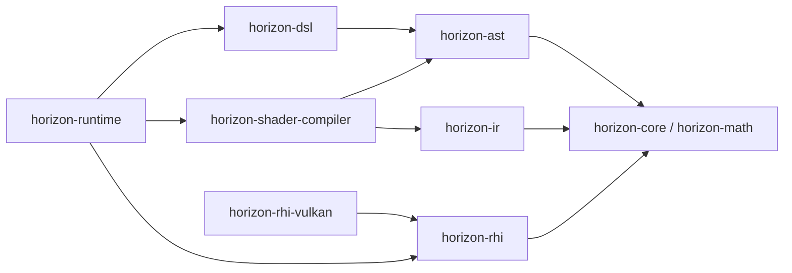

# Horizon GPU 编程架构

> 状态：目标设计，尚未全部实现
>
> 首个后端：Vulkan
>
> 首期范围：Compute Shader、光栅化、硬件光线追踪

## 1. 定位与当前状态

Horizon 是 GPU 编程与 Shader 基础设施，不承担材质系统、场景系统或渲染图等引擎职责。
目标架构把语言构造、编译、后端抽象和运行时集成拆成独立模块，消除旧 Ocarina 中
DSL 与 RHI 的双向依赖。

当前 `src/` 已有 `core`、`math`、`image`、`ast` 和 `dsl`；`dsl/diagnostics` 与
`dsl/tensor` 已删除。`runtime` 已建立迁移目录，第一批旧适配头也已切换到
`horizon::runtime` 命名空间，但尚未接入 CMake target。`ir`、`shader_compiler`、新
RHI 和 Vulkan 后端仍是目标模块，不能视为已经实现。旧 `modules/ocarina` 仅作为迁移
参考，最终淘汰。

## 2. 模块拓扑

箭头表示左侧模块可以依赖右侧模块：



`horizon-runtime` 是唯一允许同时依赖 DSL/compiler 与 RHI 的集成模块。RHI 及后端不得
依赖 AST、DSL 或 compiler。

## 3. 模块职责

| 模块 | 职责 | 不负责 |
| --- | --- | --- |
| `core` / `math` | 基础类型、容器、工具和数学类型 | Shader 语义、GPU 资源 |
| `ast` | 唯一一套 Shader AST、节点所有权和基本结构校验 | 代码生成、RHI 资源 |
| `dsl` | 将 C++ 表达式、控制流和逻辑资源访问构造成 AST | 编译、上传、pipeline、command |
| `ir` | 独立的 Shader 中间表示：module、function、block、value、instruction | AST lowering、SPIR-V 生成、GPU 执行 |
| `shader_compiler` | AST 校验与 lowering、IR pass、目标代码生成、reflection、diagnostics、artifact key | 物理资源、pipeline 和命令提交 |
| `rhi` | 后端无关的无类型资源、pipeline、descriptor、command、queue 与同步接口 | DSL、AST 和 Shader 编译 |
| `rhi::vulkan` | 使用 Vulkan 实现 RHI，并提供显式 native interop | 向普通上层 API 泄漏 Vulkan 类型 |
| `runtime` | typed host 资源、自动捕获、DSL 编译入口、reflection 绑定、诊断和 dispatch | 定义第二套 AST 或后端 native API |

## 4. IR 与编译器

IR 是顶级模块，目录为 `src/ir`，命名空间为 `horizon::ir`。它不依赖 AST、DSL、
RHI 或 Vulkan，也不保存 `ast::Function *`；旧 Ocarina 中只包装 AST 指针的
`IRFunction` 不能直接沿用。

编译器目录负责所有转换：

```text
src/shader_compiler/
├─ frontend/ast_to_ir.*
├─ passes/...
└─ backends/spirv/ir_to_spirv.*
```

首期编译数据流：

```text
dsl::Kernel
  -> ast::Function
  -> shader_compiler::AstToIR
  -> ir::Module
  -> validation / canonicalization / resource lowering
  -> SPIR-V + reflection + diagnostics
  -> ShaderArtifact
```

`ShaderArtifact` 至少包含目标格式、二进制、entry point、stage、资源反射、push/layout
反射、结构化诊断和稳定 artifact key。当前目标格式是 SPIR-V；公共模型保留格式字段，
不把整个 compiler 接口固定为 Vulkan 专用接口。

## 5. RHI 与后端

`horizon::rhi` 是可由不同后端实现的公共接口。它只处理编译后的 Shader 二进制和
已经解析的资源/pipeline 描述：

```text
horizon-rhi             后端无关接口
horizon-rhi-vulkan      当前实现
horizon-rhi-dx12        未来可选实现
```

普通调用方持有 `rhi::Device`、`rhi::Buffer` 和 `rhi::CommandList`；Vulkan 实现内部
使用 `VulkanDevice`、`VulkanBuffer` 等具体类型。只有 native interop 接口可以暴露
Vulkan handle。

## 6. 三种资源身份

同一资源在不同阶段使用不同类型：

| 阶段 | 类型示例 | 身份 |
| --- | --- | --- |
| Shader 构造 | `dsl::BufferRef<T>` | 逻辑参数，只生成 AST，不持有显存 |
| 用户运行时 | `runtime::Buffer<T>` | typed host wrapper，负责上传、下载和绑定 |
| RHI 执行 | `rhi::Buffer` | 无类型物理资源及其生命周期 |

连接发生在 pipeline dispatch 时：reflection 将 `dsl::BufferRef<T>` 的逻辑 binding
与 `runtime::Buffer<T>` 匹配，Runtime 层再把内部 `rhi::Buffer` 交给 RHI。禁止把真实 GPU
资源捕获进 AST。

## 7. 旧混合类型的归属

- `Encodable`、`EncodedData`：迁入 `runtime/data`，负责主机数据打包和 GPU 数据访问集成。
- `Registrable`、managed resource：迁入 `runtime/resources`。
- `Polymorphic`：拆成纯 Shader 侧 `dsl::PolymorphicRef` 与运行时
  `runtime::PolymorphicSet<T>`。
- Printer、Debugger：其 AST 表达可由 DSL/compiler 支持，buffer、回读和输出属于 Runtime 层。
- 旧 `Device::compile(Kernel)`：由 Runtime facade 接收 Kernel，compiler 产生 artifact，
  RHI 只创建 shader module 和 pipeline。
- 旧 generator 的 IR 数据模型迁入 `ir`；`AstToIR` 和目标 emitter 迁入
  `shader_compiler`。

## 8. 必须保持的不变量

1. `dsl` 不包含 `ir`、compiler、Runtime、RHI 或 Vulkan 头文件。
2. `ir` 不包含 AST、DSL、Runtime、RHI 或 Vulkan 头文件。
3. `shader_compiler` 不创建物理 GPU 资源，不提交命令。
4. `rhi` 与后端不包含 AST、DSL、IR 内部模型或 compiler 头文件。
5. `runtime` 可以组合 DSL/compiler/RHI，但三者不得反向依赖 Runtime 层。
6. RHI 公共 API 不出现 `Kernel`、`Function`、`Expression` 或 `Var`。
7. DSL/AST 不保存 device 指针、native handle 或物理资源对象地址。
8. Vulkan 是当前实现，不是 RHI 公共模型。

`horizon::runtime` 表示高层集成模块；现有 `src/core/runtime` 仍属于 `horizon::core`
基础工具，`rhi::Device` 仍表示后端无关的底层设备接口，三者不能混用。

更详细的旧耦合原因、三类 pipeline 数据流和迁移验收标准见
[DSL 与 RHI 解耦设计](ocarina-dsl-rhi-redesign.md)。
