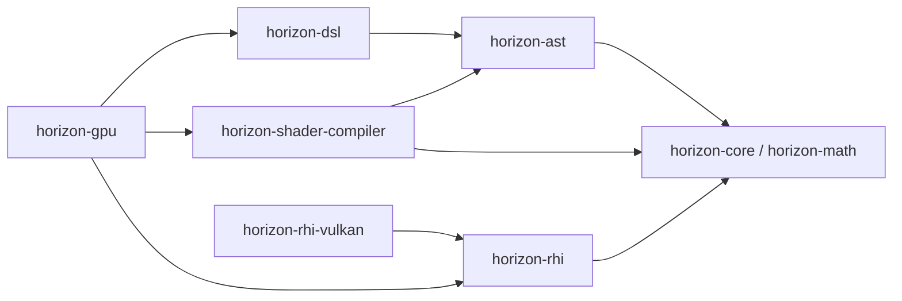

# DSL 与 RHI 解耦设计

> - 状态：设计草案
> - 日期：2026-08-22
> - 目标位置：Horizon `src/` 目录
> - 参考实现：旧 `modules/ocarina/dsl`、`modules/ocarina/rhi` 和 `modules/ocarina/generator`
> - 首个后端：Vulkan
> - 首期能力：Compute Shader、光栅化、硬件光线追踪

> 迁移记录（2026-08-23）：`src/dsl/diagnostics` 与 `src/dsl/tensor` 已删除，
> 原 `diagnostics/env.cpp` 中的 DSL 越界保护 helper 已迁入
> `src/dsl/core/ref_func.cpp`，并去除 `Env::valid_check()` 与 GPU Printer 依赖：现在始终
> 生成越界分支，以静态 Comment 代替 GPU 警告输出。新的 GPU Printer、Debugger 与 Tensor runtime 尚未实现；
> `registrable`、managed resource 和 polymorphic resource 仍是后续迁移债务。
> 由于 `src/rhi` 尚未引入，这些 opt-in resource adapter 当前也尚未接入可编译目标；
> 本阶段的可用性边界是纯 DSL/AST 核心。

## 1. 文档目的

本文解释旧 Ocarina 的 DSL 与 RHI 为什么形成双向依赖，并定义迁入 Horizon `src/` 后的新模块边界。

本设计只确定职责、依赖方向、核心数据模型和运行流程，不包含代码实现、详细任务拆分或旧 Ocarina 的原地修复。旧 `modules/ocarina` 只作为迁移参考，最终应由 `src/` 中的新实现替代并删除。

## 2. 结论

旧 Ocarina 的循环依赖不是偶然的头文件问题，而是对象模型将以下四种职责合并到了同一批类型中：

1. DSL 中的 shader 表达式构造。
2. AST 到目标代码的编译。
3. Vulkan 资源和管线的生命周期管理。
4. 命令参数绑定与 GPU 执行。

典型表现是同一个 `Buffer<T>` 既表示主机侧 GPU 资源，又能通过 `Function::current()` 变成 DSL 表达式；同一个 `Device` 既创建底层资源，又直接接收 `Kernel<T>` 编译 shader。只移动头文件或调整 CMake 链接方向无法消除这种语义耦合。

目标架构应增加独立的 `horizon::gpu` 集成层：DSL 与 RHI 互不依赖，GPU 集成层单向依赖二者，并负责 shader 编译、反射绑定和便利 API。

## 3. 当前双向依赖的形成原因

### 3.1 CMake 显式依赖与头文件隐式依赖不一致

旧目标声明的主要依赖是：

```text
ocarina-dsl -> ocarina-rhi -> ocarina-generator -> ocarina-ast
ocarina-dsl -> ocarina-ast
```

其中 `ocarina-dsl` 在 [`modules/ocarina/dsl/CMakeLists.txt`](../../modules/ocarina/dsl/CMakeLists.txt) 中公开链接 `ocarina-rhi`。但是 RHI 的公共头文件又直接包含 DSL：

- [`rhi/device.h`](../../modules/ocarina/rhi/device.h) 包含 `dsl/api/func.h` 和 `dsl/types/rtx.h`。
- [`rhi/index_buffer.h`](../../modules/ocarina/rhi/index_buffer.h) 和 [`rhi/vertex_buffer.h`](../../modules/ocarina/rhi/vertex_buffer.h) 包含 DSL Function 与 RTX 类型。
- [`rhi/rtx/accel.h`](../../modules/ocarina/rhi/rtx/accel.h) 使用 `dsl::Var` 和 shader 侧追踪操作。
- [`rhi/resources/bindless_array.h`](../../modules/ocarina/rhi/resources/bindless_array.h) 使用 DSL traits、`Var` 和表达式接口。
- [`rhi/rtx/mesh.h`](../../modules/ocarina/rhi/rtx/mesh.h) 包含 DSL struct 定义。

因此实际源代码依赖中存在 `ocarina-rhi -> ocarina-dsl`，但这个反向边没有被 CMake target 完整表达。全局或传递 include path 使它能够暂时编译，也掩盖了模块边界错误。

### 3.2 RHI 资源同时充当 DSL 表达式

旧资源类型承担两种不相容的身份：

- 主机身份：持有 device、native handle、内存范围、上传下载和析构逻辑。
- shader 身份：通过当前 `Function` 创建 `CapturedResource` 和 `Expression`，再提供 `Var<T>`、`read`、`write`、`sample`、`trace` 等 DSL 操作。

例如旧 `Buffer<T>::expression()`、`BindlessArray::expression()` 和 `Accel::expression()` 都会访问 `Function::current()`。这使 RHI 的资源定义必须理解 AST Context、变量标签、类型系统和 DSL 包装类型，从而产生 `RHI -> AST/DSL` 依赖。

这种设计还把物理资源地址或资源对象身份带入 shader 构造过程，导致 shader AST、资源生命周期和运行时绑定难以独立测试与缓存。

### 3.3 Device 同时负责 RHI 与 DSL 编译

旧 `Device` 的底层接口负责 buffer、texture、shader、stream、graphics pipeline、BLAS/TLAS 等 Vulkan 或后端资源；其公共便利接口又直接提供：

```cpp
device.compile(const Kernel<T> &kernel);
device.async_compile(Kernel<T> &&kernel);
```

这要求 RHI 认识 DSL 的 `Kernel<T>` 和 AST 的 `Function`，并让 RHI 后端负责从 AST 生成目标代码。旧 `ocarina-rhi -> ocarina-generator -> ocarina-ast` 依赖正是由此产生。

编译 shader 和创建 Vulkan shader module 是两个不同阶段：前者处理语言语义，后者只消费 SPIR-V。旧设计没有保留这个边界。

### 3.4 Dispatch 命令持有 DSL 参数模型

旧 `ShaderDispatchCommand` 持有 `ShaderArgumentPack`，旧 `Shader<T>` 根据 DSL Function 的参数和捕获资源构造参数包。于是 RHI 的 command 层需要理解：

- DSL 参数的 C++ 类型。
- AST Function 的参数顺序和资源标签。
- captured resource 与实际 handle 的对应关系。
- push value、buffer、texture、accel 等不同参数的编码方式。

RHI command 本应只记录已经解析完成的 pipeline、descriptor、push constant 和 dispatch/draw/trace 参数。让它持有 DSL 参数包会把编译期模型延伸到执行期。

### 3.5 DSL 中混入了运行时设施

反方向的 `DSL -> RHI` 不只来自基础资源参数，还来自以下运行时功能：

- diagnostics 中的 debugger、printer 和 managed buffer。
- registrable、managed、dynamic buffer 等主机存储封装。
- Tensor runtime 中的 device 编译、shader 缓存和 command batch。
- 直接调用 upload、download、stream 和 command 的便利接口。

这些功能使用 DSL 构造 kernel，同时又管理 GPU 资源和提交命令，真实职责属于集成或运行时层，而不是纯 DSL。

### 3.6 共享根命名空间弱化了所有权

旧类型大多位于同一个 `ocarina` 命名空间。`Buffer`、`Accel`、`Shader` 等名称无法说明它们属于 DSL、RHI 还是运行时封装，模板特化也容易跨目录直接引用内部细节。这使错误依赖在源码层面不明显，并鼓励一个类型继续承担多个模块的职责。

## 4. 为什么不能只改成单向 `DSL -> RHI`

把 `Device::compile`、`Buffer::expression` 等方法机械地移动到 DSL，能够消除 RHI 对 DSL 的 include，但仍会让 DSL 同时负责 AST 构造、资源生命周期、shader 编译、参数绑定和命令提交。

这种方案只有单向的编译依赖，却没有清晰的语义边界。随着光栅化和光追加入，DSL 将继续吸收 graphics pipeline、shader group、SBT、BLAS/TLAS 和 render target 等运行时概念，最终成为新的总控模块。

因此目标不是把循环依赖压成一条边，而是把产生循环的集成职责抽离为独立模块。

## 5. 设计目标与不变量

### 5.1 设计目标

- DSL 可以在没有 Vulkan SDK、Vulkan loader 和 GPU device 的环境中独立构建与测试。
- RHI 可以使用预编译 SPIR-V 独立创建资源、管线和命令，不需要 AST 或 DSL。
- 同一套 AST 支持 Compute、光栅化 shader stage 和光追 shader stage。
- Vulkan 是首个且当前唯一实现后端，公共接口允许采用 Vulkan 风格的显式资源与同步模型。
- 用户仍可获得类似 `compile(kernel)` 和 typed dispatch 的便利体验，但便利接口属于 GPU 集成层。
- 资源绑定发生在 pipeline 使用时，不把物理 GPU 资源捕获进 AST。

### 5.2 必须保持的依赖不变量

1. `horizon-dsl` 不包含 RHI 或 Vulkan 头文件。
2. `horizon-rhi` 和 Vulkan 实现不包含 DSL、AST 或 shader generator 头文件。
3. `horizon-shader-compiler` 只消费 AST，不管理 GPU 资源。
4. `horizon-gpu` 是唯一允许同时依赖 DSL/compiler 与 RHI 的模块。
5. RHI 公共接口不出现 `Kernel`、`Function`、`Expression`、`Var` 或 DSL traits。
6. DSL 公共接口不出现 Vulkan handle、RHI device、command list 或物理资源所有权。
7. AST 只保存逻辑资源参数及其访问语义，不保存 RHI handle、device 指针或资源对象地址。

## 6. 目标模块与依赖拓扑

箭头表示左侧模块可以依赖右侧模块：



应用层主要使用 `horizon::dsl` 描述 shader，使用 `horizon::gpu` 创建 typed 资源、编译 pipeline 并提交工作。只有需要底层控制或 native interop 的代码直接使用 `horizon::rhi`。

### 6.1 `horizon::dsl`

职责：

- 将 C++ 表达式、控制流和资源访问转换为 AST。
- 提供 Compute、vertex、fragment、ray generation、miss、closest hit、any hit 等 stage 的函数构造接口。
- 提供纯 shader 侧资源引用，如 `BufferRef<T>`、`TextureRef<T>`、`SamplerRef` 和 `AccelRef`。
- 记录资源的逻辑类型、访问方式和 stage 使用情况。

不负责：

- 创建、上传或销毁 Vulkan 资源。
- 编译 SPIR-V。
- 创建 pipeline、descriptor 或 command。
- 捕获主机侧 GPU 资源对象。

### 6.2 `horizon::shader_compiler`

职责：

- 校验并降低 `ast::Function`。
- 生成 SPIR-V。
- 产生与 SPIR-V 对应的反射数据和结构化诊断。
- 保证相同 AST、stage 和编译选项得到可缓存的稳定 artifact key。

编译结果采用独立于 RHI 的 `ShaderArtifact`：

```text
ShaderArtifact
├─ shader stage
├─ entry point
├─ SPIR-V words
├─ resource binding reflection
├─ push/uniform data layout
├─ stage input/output reflection
├─ compute workgroup size（若适用）
└─ diagnostics and artifact key
```

RHI 不直接消费 AST；GPU 集成层把 `ShaderArtifact` 转换为明确的 RHI shader module 和 pipeline 描述。

### 6.3 `horizon::rhi`

职责：

- 定义 untyped GPU 资源：buffer、image、image view、sampler、BLAS、TLAS。
- 定义 shader module、descriptor layout、pipeline layout、compute/graphics/ray-tracing pipeline。
- 定义 command list、queue、fence、semaphore、barrier 和资源状态转换。
- 定义光栅化 attachment、dynamic rendering、draw 和 indirect draw。
- 定义 BLAS/TLAS build、SBT 和 trace rays 所需的底层描述。
- 提供显式 native Vulkan interop 入口，但不让 Vulkan 类型渗入普通 DSL 或 GPU facade API。

RHI buffer 是一段无类型字节存储；元素类型属于 DSL 或 GPU typed wrapper。RHI 只接受 SPIR-V、显式 pipeline layout 和已解析的 descriptor/push constant 数据。

### 6.4 `horizon::rhi::vulkan`

职责：

- 实现 `horizon::rhi` 中的资源、管线、descriptor、command、queue 和同步语义。
- 管理 Vulkan instance、physical device、logical device、queue family 和 feature chain。
- 实现 Vulkan validation、object naming、native handle 导入导出和错误翻译。
- 实现 Compute、dynamic rendering 光栅化和 `VK_KHR_ray_tracing_pipeline`/`VK_KHR_acceleration_structure`。

首期不要求设计或实现 DX12/CUDA 后端，也不为假想后端削弱 Vulkan 的显式能力模型。Vulkan 专用扩展能力通过 capability 与 extension 接口表达，不进入 DSL。

### 6.5 `horizon::gpu`

这是从旧 DSL/RHI 混合代码中抽离出的集成封装层，也是解决循环依赖的关键。

职责：

- 提供用户可见的 typed host 资源，如 `gpu::Buffer<T>`、typed texture view 和 acceleration structure wrapper。
- 接受 DSL kernel/stage，调用 shader compiler，并创建 RHI shader module 与 pipeline。
- 根据 reflection 验证参数类型、资源访问模式、stage IO 和 pipeline layout。
- 把 typed 参数转换为 descriptor write、push constant 和 RHI resource view。
- 提供 Compute dispatch、graphics draw 和 ray tracing dispatch 的便利接口。
- 管理 shader/pipeline cache、SBT 组装及与编译产物相关的运行时元数据。
- 承接旧 DSL 中的 debugger、printer、managed resource 等确实需要同时使用 DSL 与 RHI 的设施。

GPU 层可以提供 `device.compile(kernel)` 风格的 facade，但其内部必须保持“先编译 artifact，再创建 RHI pipeline”的阶段边界。

## 7. 三种资源身份必须分离

同一概念在不同阶段应使用不同类型，并通过命名空间明确所有者：

| 阶段 | 示例类型 | 身份与职责 |
| --- | --- | --- |
| Shader 构造 | `dsl::BufferRef<T>`、`dsl::TextureRef<T>`、`dsl::AccelRef` | AST 表达式和逻辑参数，不拥有物理资源 |
| Vulkan 执行 | `rhi::Buffer`、`rhi::Image`、`rhi::AccelerationStructure` | 无类型物理资源及其生命周期 |
| 用户运行时 | `gpu::Buffer<T>`、`gpu::Texture<T>`、`gpu::AccelerationStructure` | typed host wrapper，内部持有或引用 RHI 资源 |

禁止重新引入一个跨三层通用的 `Buffer<T>`。模板元素类型、访问操作与 AST 表达式属于 DSL/GPU；device address、allocation 和 native handle 属于 RHI。

### 7.1 Kernel 参数必须是逻辑参数

DSL Function 中的资源参数由函数签名或显式 kernel builder 创建，例如：

```cpp
auto kernel = dsl::compute_kernel(
    [](dsl::BufferRef<float> input,
       dsl::BufferRef<float> output,
       dsl::UInt count) {
        // 只构造 AST
    });
```

构造 AST 时不传入 `gpu::Buffer<float>` 或 `rhi::Buffer`，也不通过资源地址形成 captured resource。实际资源在 dispatch 时绑定：

```cpp
pipeline.dispatch(command_list, dispatch_size, input_buffer, output_buffer, count);
```

GPU facade 可以提供具名参数或生成的 typed binding wrapper，但绑定对象始终与 AST 分离。

## 8. 编译与执行数据流

### 8.1 Compute Shader

```text
DSL compute kernel
    -> AST Function
    -> shader_compiler::compile
    -> ShaderArtifact(SPIR-V + reflection)
    -> gpu::ComputePipeline
    -> rhi::ComputePipeline
    -> bind resources / push values
    -> rhi::CommandList::dispatch
    -> Vulkan queue submit
```

RHI 只看到 SPIR-V、pipeline layout、descriptor、push constant 和 group count。

### 8.2 光栅化

```text
DSL vertex stage + fragment stage
    -> independent AST Functions
    -> independent ShaderArtifacts
    -> gpu layer validates stage interface
    -> explicit RHI graphics pipeline description
    -> begin rendering / bind / draw
    -> Vulkan queue submit
```

DSL 描述 shader stage 内部语义；vertex input、attachment format、depth/stencil、blend、rasterizer state 和 dynamic rendering attachment 属于 GPU/RHI pipeline 描述，不写入 DSL AST。

### 8.3 硬件光线追踪

```text
DSL raygen / miss / hit stages
    -> ShaderArtifacts
    -> gpu layer builds shader groups and validates payload interfaces
    -> rhi ray-tracing pipeline + SBT
    -> rhi BLAS/TLAS resources and build commands
    -> bind TLAS as dsl::AccelRef parameter
    -> trace rays command
```

shader 内的 `trace_ray`、ray query、payload 和 hit attribute 是 DSL/AST 语义。BLAS/TLAS 的内存、build flags、scratch buffer、compaction、SBT 地址和 Vulkan handle 是 RHI 语义。GPU 层负责把二者连接起来。

## 9. 参数反射与绑定规则

`ShaderArtifact` 的 reflection 至少描述：

- 参数序号和稳定 binding key。
- 参数类别：plain data、buffer、sampled image、storage image、sampler、acceleration structure。
- 元素或结构布局、尺寸、对齐和读写属性。
- shader stage visibility。
- descriptor set/binding 的确定性分配结果。
- push constant 或普通 uniform 的布局。

GPU 层在 pipeline 创建或首次绑定时完成以下验证：

1. 参数数量与类别匹配。
2. typed buffer 的元素布局与 shader 逻辑类型匹配。
3. image format、dimension 和访问模式兼容。
4. acceleration structure 类型正确。
5. 写资源具有对应 RHI usage flag。
6. 光栅化 stage input/output 和 attachment 数量兼容。
7. 光追 payload、attribute 和 shader group 关系兼容。

验证完成后生成普通 RHI descriptor write 和 push constant 数据。RHI 不再接收 `ShaderArgumentPack` 或任何 DSL 参数对象。

## 10. 命令模型

旧的多态 `Command` 对象可以作为迁移参考，但新边界必须满足：

- DSL 不创建运行时命令。
- RHI command list 只记录已经解析的底层操作。
- GPU pipeline facade 可以把 typed 调用展开为一组 RHI 操作，但不能把 DSL Function 或表达式保存在 command 中。
- command 必须通过资源引用或 keep-alive token 保证执行期生命周期，不依赖 AST captured resource 延长生命周期。
- barrier、queue ownership 和同步属于 RHI；DSL 不推断 Vulkan 同步。

对首个 Vulkan 实现，可采用显式 command encoder 或内部 POD command IR。无论采用哪种实现，公开边界都不能重新引入 DSL 参数包。

## 11. 错误与诊断边界

错误应在最了解语义的层报告：

- DSL/AST：跨 Function Context、非法表达式、非法 stage builtin。
- Shader compiler：AST lowering、SPIR-V 生成、stage interface 和编译诊断。
- GPU：资源类型不匹配、缺少绑定、pipeline 组合错误、光追 shader group 错误。
- RHI/Vulkan：不支持的 feature、资源创建失败、非法 usage、Vulkan 调用和 device lost。

旧代码中大量可能失败的创建与编译接口被标为 `noexcept`。新公共接口不得在失败路径实际存在时无条件 `noexcept`。编译接口返回包含 diagnostics 的结果对象；RHI/Vulkan 失败转换为带 operation、object 和 `VkResult` 信息的结构化错误。

## 12. 测试与依赖边界验证

### 12.1 DSL 独立测试

- 不链接 Vulkan 或 RHI 构造 Compute、vertex、fragment 和 ray tracing AST。
- 验证资源参数只产生逻辑 AST 节点，不包含 host pointer 或 native handle。
- 验证相同 kernel 的 AST hash 不受绑定资源实例影响。

### 12.2 Compiler 独立测试

- 使用固定 AST fixture 生成 SPIR-V 与 reflection。
- 验证 stage IO、descriptor binding、push layout 和 artifact key 稳定。
- 使用 SPIR-V validation 检查产物。

### 12.3 RHI/Vulkan 独立测试

- 使用预编译 SPIR-V 测试 Compute、光栅化和光追，不链接 DSL。
- 测试资源生命周期、barrier、descriptor、queue synchronization、BLAS/TLAS 和 SBT。

### 12.4 GPU 集成测试

- 从 DSL kernel 完整走通 compile、pipeline、binding 和 submit。
- 对参数类型、资源 usage、stage interface 和 shader group 不匹配增加失败用例。

### 12.5 自动依赖检查

- `src/dsl` 中禁止包含 `rhi/`、`gpu/` 和 Vulkan 头文件。
- `src/rhi` 与 Vulkan 实现中禁止包含 `dsl/`、`ast/` 和 compiler/generator 头文件。
- CMake target 必须准确声明所有公开和私有依赖，不依赖全局 include path 掩盖反向边。

## 13. 迁移原则

迁移应按边界而不是旧目录逐文件复制：

1. 从旧 RHI 资源中识别纯物理资源职责，迁入新 RHI/Vulkan 实现。
2. 将 `expression()`、`var()`、`trace_*()`、shader 侧 `read/write/sample` 等逻辑迁入 DSL resource ref。
3. 将 AST 到 SPIR-V 的逻辑迁入 shader compiler，禁止新 RHI 链接 generator。
4. 将 `Device::compile(Kernel)`、typed `Shader<T>` 和参数打包迁入 GPU facade。
5. 将旧 DSL diagnostics、managed resource 等需要 device 的设施迁入 GPU 或更上层工具模块。
6. 先让 DSL、compiler、RHI 分别独立构建，再接入 GPU 集成层。
7. 新 `src/` 调用点迁移完成后删除旧 `modules/ocarina`，不维持两套长期并行实现。

## 14. 不采用的方案

### 14.1 只用前置声明或接口类打断 include

这只能隐藏编译依赖，不能消除 RHI 资源调用 `Function::current()`、Device 接收 Kernel、command 持有 DSL 参数包等语义依赖。

### 14.2 让 DSL 单向依赖 RHI

虽然 target 图无环，但 DSL 会继续承担资源、编译和执行职责，加入光栅化与光追后会再次成为总控模块。

### 14.3 建立 DSL/RHI 共同依赖的通用资源类型

共享一个 typed `Buffer<T>` 容易再次混合 shader 表达式和物理资源。允许共享的是纯值描述与枚举，不允许共享带 device、handle、AST Context 或资源所有权的对象。

### 14.4 让 RHI 直接消费 AST

这会把语言前端固定进 Vulkan 执行层，使预编译 SPIR-V、离线编译、RHI 独立测试和未来替换 compiler 都变得困难。

## 15. 最终架构判定标准

完成重构后，应能同时满足以下检查：

1. 删除 `horizon-dsl` 后，RHI/Vulkan 仍可使用预编译 SPIR-V 完成 Compute、光栅化和光追测试。
2. 删除 Vulkan/RHI 后，DSL 与 AST 测试仍可构造所有目标 shader stage。
3. shader compiler 输入只有 AST 与编译选项，输出只有 artifact 与 diagnostics。
4. GPU 集成层是依赖图中唯一同时接触 DSL/compiler 和 RHI 的模块。
5. host 资源实例不会改变 kernel AST 或编译缓存 key。
6. RHI 公共头文件中不存在 DSL/AST 类型，DSL 公共头文件中不存在 RHI/Vulkan 类型。

满足这些条件，DSL 与 RHI 才是实质解耦，而不只是 CMake target 图表面无环。
