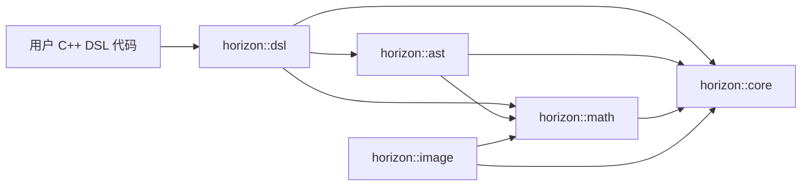
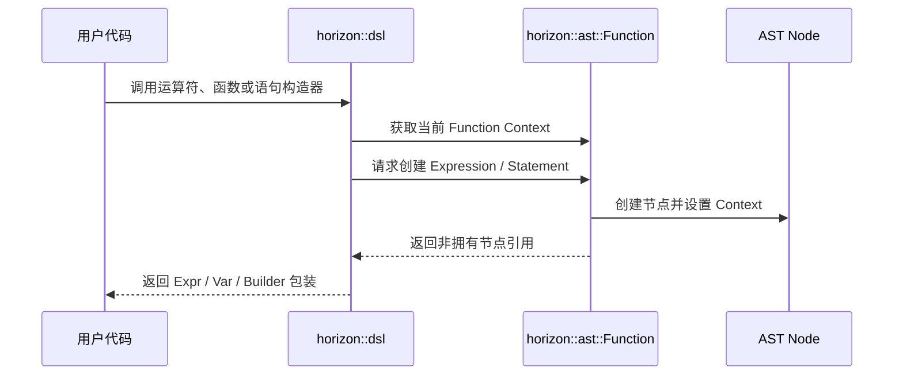
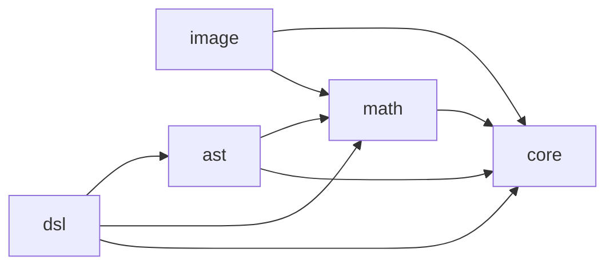

# Horizon 核心语言层架构概览

> 状态：迁移中  
> 文档范围：覆盖 `src/core`、`src/math`、`src/image`、`src/ast`、`src/dsl`
> 不在范围内：`src/` 下其他目录、旧 Ocarina 的 generator、RHI、后端及运行时集成

## 1. 文档目的

本文档描述 Horizon 当前正在迁移的语言层基础模块，以及已经从 DSL 中拆出的 host Image 模块，统一说明它们的职责、依赖方向、数据流和必须保持的架构不变量。

文档中的内容分为两类：

- **当前状态**：代码仓库现在已经存在的结构和依赖。
- **目标架构**：迁移完成后应达到的模块边界。

除非明确标记为“当前状态”，本文档中的依赖约束均表示目标设计。不能因为文档描述了目标结构，就假定对应重构已经完成。

## 2. 总体目标

四个模块共同构成从用户 DSL 到结构化 AST 的语言层：



目标依赖方向为：

```text
dsl -> ast -> math -> core
image -> math -> core
```

箭头表示左侧模块可以依赖右侧模块。上层模块也可以直接使用更底层的公共接口，例如 DSL 可以直接使用 Core 类型，但底层模块不能反向依赖上层模块。

## 3. 模块职责

| 模块 | 命名空间 | 核心职责 | 不应承担的职责 |
| --- | --- | --- | --- |
| `src/core` | `horizon::core` | 基础类型、类型系统、容器封装、通用工具、并发与基础运行时设施 | AST 节点、DSL 语义、面向 DSL 的模板特化 |
| `src/math` | `horizon::math` | 标量、向量、矩阵、区间、几何类型及数学算法 | AST 所有权、DSL 表达式构造、运行时资源管理 |
| `src/image` | `horizon::image` | CPU 图像存储、像素转换及 PNG/JPEG/BMP/TGA/HDR/EXR 编解码 | AST/DSL 表达式、GPU texture、RHI/Vulkan Image |
| `src/ast` | `horizon::ast` | 唯一一套 AST 模型、节点所有权、Context、Visitor、校正和布局解析 | 用户 DSL 包装、第二套语法树、后端代码生成 |
| `src/dsl` | `horizon::dsl` | 用户可见的表达式和语句构造接口，将 C++ 操作转换为 AST | 复制 AST 状态、绕过 AST 工厂自行管理节点、基础类型系统实现 |

## 4. Core

Core 是四个模块的基础层，主要内容包括：

- STL 和容器封装。
- 通用 concepts、hash、日志、字符串及实用工具。
- `Type`、类型描述、类型注册和精度策略。
- 动态 Buffer 的布局描述、编码和主机端存储。
- 基础并发、平台和动态库设施，以及不依赖 Math 的 `PixelStorage` 格式协议。

Core 对上层提供稳定的基础类型和公共服务。Core 不应知道 Math 的具体类型，也不应知道 AST 节点、DSL 包装类型或 DSL 的构造过程。

Core 直接拥有类型系统和动态 Buffer；Math 只通过 Core 提供的布局 traits 和标量存储扩展点接入自己的向量、矩阵、real 与 half。Core 的公共头文件不能包含 Math。

关键入口包括：

- [`src/core/header.h`](../../src/core/header.h)
- [`src/core/stl.h`](../../src/core/stl.h)
- [`src/core/type.h`](../../src/core/type.h)
- [`src/core/type_system/`](../../src/core/type_system/)
- [`src/core/dynamic_buffer/`](../../src/core/dynamic_buffer/)
- [`src/core/type_system/precision_policy.h`](../../src/core/type_system/precision_policy.h)
- [`src/math/storage_traits.h`](../../src/math/storage_traits.h)
- [`src/math/type_system/`](../../src/math/type_system/)

## 5. Math

Math 提供语言层共享的数值类型和算法，主要包括：

- 标量、半精度和实数类型。
- `Vector`、`Matrix`、Swizzle 及对应 traits。
- 数学常量、标量函数和通用运算。
- 区间、Box、几何、四元数及变换工具。

Math 应建立在 Core 的容器、traits 和基础工具之上，不应依赖 AST 或 DSL。

Math 当前不直接包含 AST 或 DSL。DSL 对 Math traits 的扩展仍是后续需要继续收敛的兼容代码，不能反向加入 Math 的公共头文件。

关键入口包括：

- [`src/math/basic_types.h`](../../src/math/basic_types.h)
- [`src/math/basic_traits.h`](../../src/math/basic_traits.h)
- [`src/math/vector_types.h`](../../src/math/vector_types.h)
- [`src/math/matrix_types.h`](../../src/math/matrix_types.h)
- [`src/math/storage_traits.h`](../../src/math/storage_traits.h)

### 5.1 Image

Image 是独立的 host 侧图像模块，负责 CPU 像素缓冲、格式转换和文件编解码。它可以使用 Math 的向量类型与 Core 的 `PixelStorage`，但不依赖 AST、DSL、RHI 或 Vulkan。GPU texture 上传属于未来 GPU 集成层，不属于 `horizon-image`。

关键入口包括：

- [`src/image/image_base.h`](../../src/image/image_base.h)
- [`src/image/image.h`](../../src/image/image.h)
- [`src/core/image/image_format.h`](../../src/core/image/image_format.h)

## 6. AST

AST 是 Helicon 与 Ocarina 合并后的唯一语法树模型。任何上层语法构造和后续处理都应围绕这一套节点工作，不应再建立平行 AST。

AST 当前包含：

- `ASTNode`：节点公共基类和 Context 校验入口。
- `Expression` 及其派生节点。
- `Statement` 及其派生节点。
- `Variable`、操作符枚举和符号信息。
- `Function`：节点所有者、构建上下文和函数级状态容器。
- Expression/Statement Visitor。
- Function Corrector 和 Layout Resolver。

### 6.1 所有权与 Context

`Function` 当前集中持有表达式和语句节点。节点由 Function 的创建接口生成，并在创建时关联所属 Function：

```text
Function
├─ owns Expression nodes
├─ owns Statement nodes
├─ owns Variable metadata
└─ provides current construction Context
```

`ASTNode::context_` 表示节点所属的 Function。`check_context()` 及递归辅助逻辑用于确认一棵表达式或语句子树没有混入其他 Function 的节点。

必须保持以下不变量：

1. 一个 AST 节点只能属于一个 Function Context。
2. Function 持有节点生命周期，DSL 只保存非拥有引用或句柄。
3. 组合节点时，所有子节点必须来自兼容的 Context。
4. Context 校验失败应产生可定位的诊断，不能只依赖未定义行为暴露问题。
5. AST 节点行为通过虚接口和 Visitor 表达，不在节点中重新引入函数对象成员模拟多态。

关键入口包括：

- [`src/ast/ast_node.h`](../../src/ast/ast_node.h)
- [`src/ast/expression.h`](../../src/ast/expression.h)
- [`src/ast/statement.h`](../../src/ast/statement.h)
- [`src/ast/function.h`](../../src/ast/function.h)
- [`src/ast/variable.h`](../../src/ast/variable.h)

## 7. DSL

DSL 是用户代码与 AST 之间的构造层。它把 C++ 类型、运算符和控制流包装为 AST 构造调用。

DSL 主要包含：

- `Ref`、`Expr`、`Var` 及其类型 traits。
- 一元、二元及内建函数操作。
- If、Switch、Loop、For、Return、Print 等语句构造器。
- Callable、Kernel 和 Lambda 包装。
- Dynamic Array、SOA、结构体映射和可编码数据。
- Tensor 和 RTX 相关的 DSL 表达。

DSL 的核心职责是“翻译”，而不是拥有另一套语义状态：



DSL 不应直接 `new` AST 节点，也不应复制 AST 节点或 Function 状态。所有 AST 创建都应经过 Function 或未来统一的 AST Builder 接口。

关键入口包括：

- [`src/dsl/dsl.h`](../../src/dsl/dsl.h)
- [`src/dsl/core/expr.h`](../../src/dsl/core/expr.h)
- [`src/dsl/core/ref.h`](../../src/dsl/core/ref.h)
- [`src/dsl/core/var.h`](../../src/dsl/core/var.h)
- [`src/dsl/api/`](../../src/dsl/api/)

## 8. 当前依赖状态

当前代码已经拆分为四个 `horizon` 子命名空间，Core 与 Math 的依赖边界已经收敛为单向：



仍需继续处理的迁移债务：

- Math target 中仍保留面向 Core 扩展点的数值布局适配代码；这些适配不得回流为 Core 对 Math 的直接依赖。
- DSL 中仍有针对 Math 类型的兼容特化，应继续保持在 DSL 侧。
- 模块内部使用了部分兼容性 `using namespace`，会弱化类型真实所有者的可见性。
- 不同模块过去共享的 `detail` 已经拆分，仍需继续核对特化和辅助函数的真实归属。
- DSL 的部分实现会进入尚未迁移的旧 generator、RHI 或其他 Ocarina 模块。

新增代码不得以“现有代码已经循环依赖”为理由继续扩大反向依赖。

## 9. 构建接入状态

这五个目录已经接入根工程的 `src/CMakeLists.txt`，并分别生成 `horizon-core`、`horizon-math`、`horizon-image`、`horizon-ast` 和 `horizon-dsl` target。测试 target 默认启用，用于验证基础模块行为、图像格式往返以及 Core/Math、Image/DSL 依赖边界。

`HORIZON_BUILD_ENGINE=OFF` 时，工程只配置这五个基础设施模块及其测试，不配置 Helicon、顶层 `Horizon` target 或引擎专用依赖。`core` 目标族使用这一模式；直接构建完整 `Horizon` 时使用独立的 `engine` 目标族。

五个基础设施 target 的 host 构建范围为 Windows、Linux 和 macOS。Core 平台运行时由 CMake 在 Windows 后端与 POSIX 后端之间选择。该范围不表示 Helicon、Vulkan、Slang、Ocarina、示例和工具已经完整支持 Linux 或 macOS。

各目录中的局部 `CMakeLists.txt` 已按 Horizon target 命名；旧 Ocarina 目录不属于本架构的验证范围。

修改这四个模块时至少需要：

1. 检查修改文件是否被实际 target 覆盖。
2. 对未接入 target 的头文件进行聚合语法检查。
3. 对可独立编译的实现文件执行单文件检查。
4. 明确区分本模块错误与旧 generator/RHI 引起的外部阻断。
5. 不把 `ninja: no work to do` 当作本模块编译通过的证据。

## 10. 目标演进顺序

建议按照基础依赖从下到上的顺序收敛：

1. 稳定 Core 的公共类型、类型系统和扩展机制。
2. [已完成] 解除 Core 与 Math 的双向依赖，使 Math 单向依赖 Core。
3. 将 Math 中的 DSL 感知逻辑迁回 DSL，使 Math 不再依赖 DSL。
4. 稳定 AST 的节点所有权、Context、Validator 和 Visitor 接口。
5. 让 DSL 只通过 AST 公共构建接口生成节点。
6. 持续收敛兼容层，并通过依赖边界检查和测试保持四个模块的构建与验证。

任何阶段都必须保持代码处于可解释状态：临时兼容层要标明用途，当前状态和最终目标要分别记录，不能以目标文档替代实际验证。

## 11. 文档维护规则

出现以下变化时必须更新本文档：

- 四个模块的职责边界改变。
- 允许的依赖方向改变。
- AST 所有权或 Context 模型改变。
- DSL 创建 AST 的入口改变。
- 四个目录正式接入或退出某个 CMake target。
- 当前列出的循环依赖被消除或出现新的循环依赖。

模块内部文件调整、私有辅助函数重命名或不影响架构边界的实现优化，不需要更新本文档。
